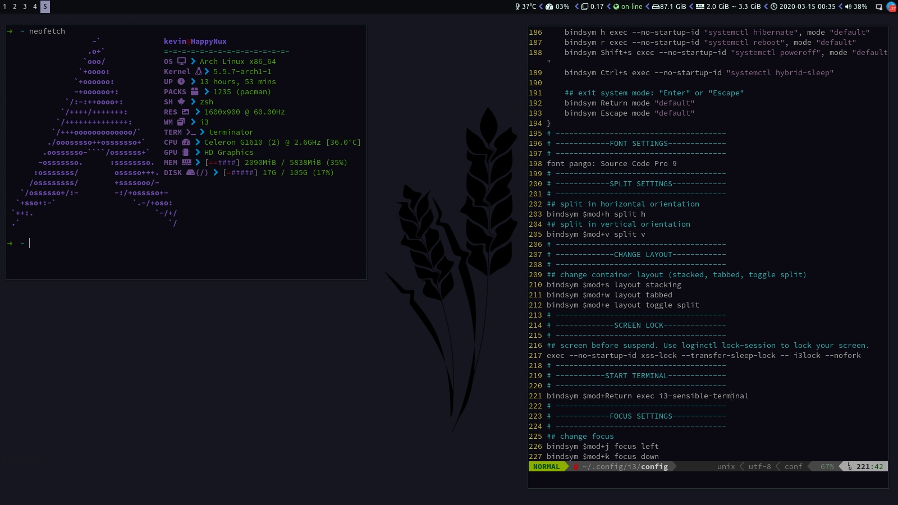
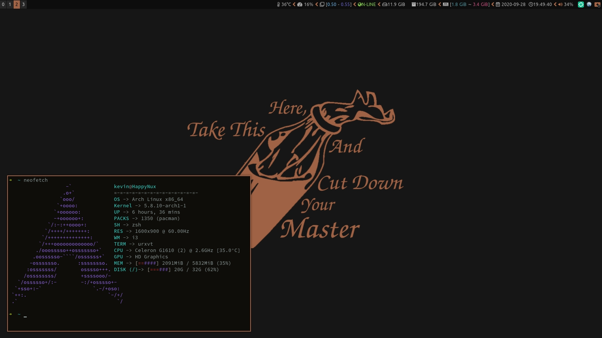

# Myi3
my i3 window manager config file

## Dependencies
* Feh
* Rofi
* Awesome Font
* NetworkManager-applet
* i3-gaps
* playerctl
* Pulseaudio

## My i3-status config
my i3-status bar config file
[click for see](https://github.com/kevinscruff/my-i3status)

## TODO list
- [x] add gaps settings
- [x] change colors
- [x] re write and debug
- [x] add more comments
- [x] optimization for cpu and memory
- [x] add screenshot dir
- [x] add new screenshot
- [ ] create package for dependencies
- [ ] add installer
- [x] change i3-status config
- [ ] display keyboard language

## ScreenShot
my config screenshot

